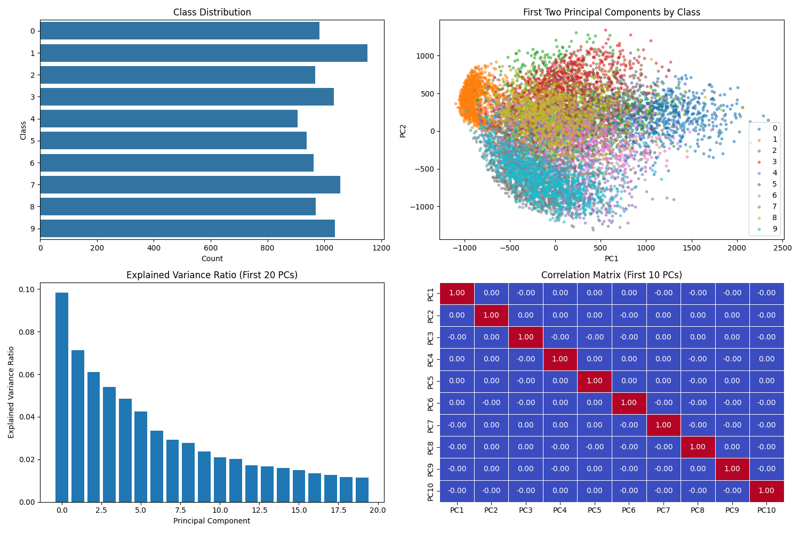
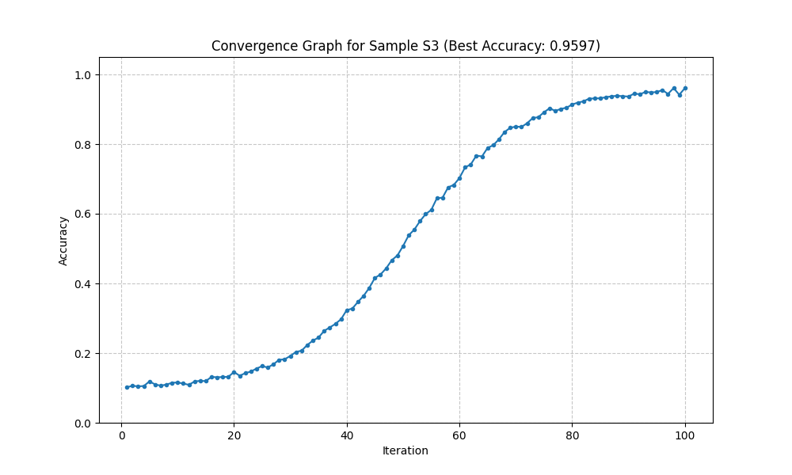
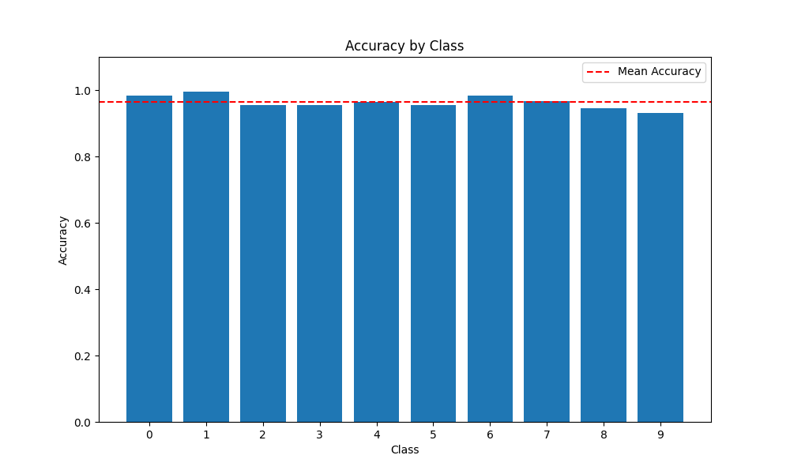

# SVM Optimization Report

## Dataset Information
- Dataset: MNIST Digits (10,000 samples from original UCI dataset)
- Instances: 10000
- Features: 50 (reduced from 784 using PCA)
- Classes: 10

## Methodology
In this project, we perform Support Vector Machine (SVM) optimization on the MNIST dataset. The process involves the following steps:
- Data Preprocessing:
  - We load the MNIST dataset using fetch_openml and sample 10,000 instances to make computation more feasible.
  - The data is then reduced to 50 principal components (PCA) to speed up training and reduce dimensionality.
- Data Splitting:
  - We split the dataset into training and testing sets using a 70-30 ratio for each of 10 different samples.
- Hyperparameter Tuning:
  - An SVM model is optimized for each sample using a grid search over hyperparameters: C, gamma, and kernel type.
  - The goal is to find the best-performing hyperparameter combination for each sample.
- Model Training and Evaluation:
  - The SVM model is trained using the optimal parameters, and performance is evaluated using accuracy, confusion matrix, and classification report.

## Optimization Results
- Best performing sample: S3
- Best accuracy achieved: 0.9597
- Best parameters for S3: Kernel=rbf, C=10, Gamma=0.01

## Conclusion
The SVM model was optimized on 10 different random samples of the MNIST digits dataset with a 70-30 train-test split.
The best performance was achieved with Sample S3 using the parameters reported above.

## Results Table

| Sample | Best Accuracy | Kernel | C   | Gamma |
|--------|---------------|--------|-----|-------|
| S1     | 0.9587        | rbf    | 10  | 0.01  |
| S2     | 0.9480        | rbf    | 10  | 0.01  |
| S3     | 0.9597        | rbf    | 10  | 0.01  |
| S4     | 0.9493        | rbf    | 10  | 0.01  |
| S5     | 0.9510        | rbf    | 10  | 0.01  |
| S6     | 0.9537        | rbf    | 10  | 0.01  |
| S7     | 0.9527        | rbf    | 10  | 0.01  |
| S8     | 0.9527        | rbf    | 10  | 0.01  |
| S9     | 0.9577        | rbf    | 10  | 0.01  |
| S10    | 0.9547        | rbf    | 10  | 0.01  |

## Confusion Matrix for Best Model



## Classification Report for Best Model

```
              precision    recall  f1-score   support

           0       0.97      0.98      0.98       302
           1       0.98      0.99      0.98       361
           2       0.96      0.95      0.96       285
           3       0.95      0.95      0.95       288
           4       0.96      0.96      0.96       279
           5       0.96      0.95      0.96       285
           6       0.96      0.98      0.97       285
           7       0.97      0.97      0.97       308
           8       0.95      0.94      0.95       287
           9       0.97      0.93      0.95       320

    accuracy                           0.96      3000
   macro avg       0.96      0.96      0.96      3000
weighted avg       0.96      0.96      0.96      3000
```

## Per-Class Accuracy

| Class | Accuracy |
|-------|----------|
| 0     | 0.9834   |
| 1     | 0.9945   |
| 2     | 0.9544   |
| 3     | 0.9549   |
| 4     | 0.9642   |
| 5     | 0.9544   |
| 6     | 0.9825   |
| 7     | 0.9675   |
| 8     | 0.9443   |
| 9     | 0.9313   |

## Convergence Graph for Best Model



## Accuracy by Class



